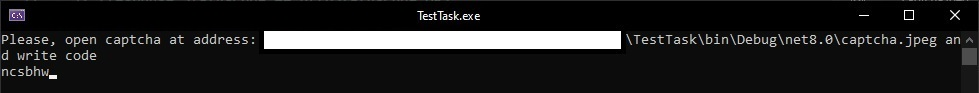
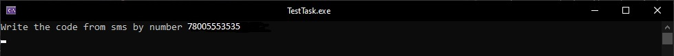
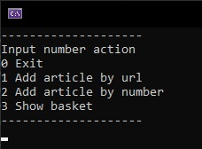
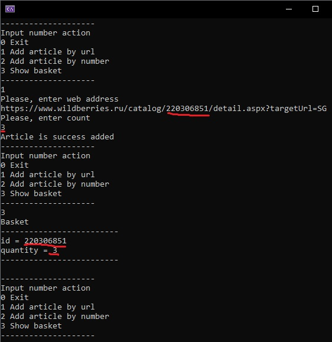
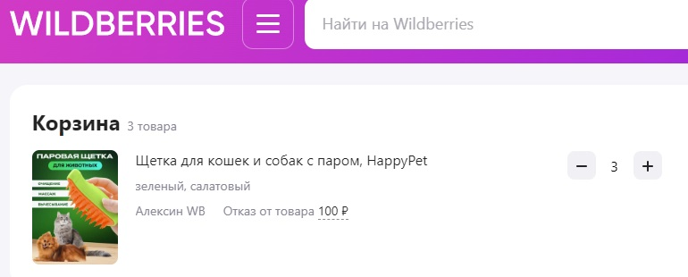
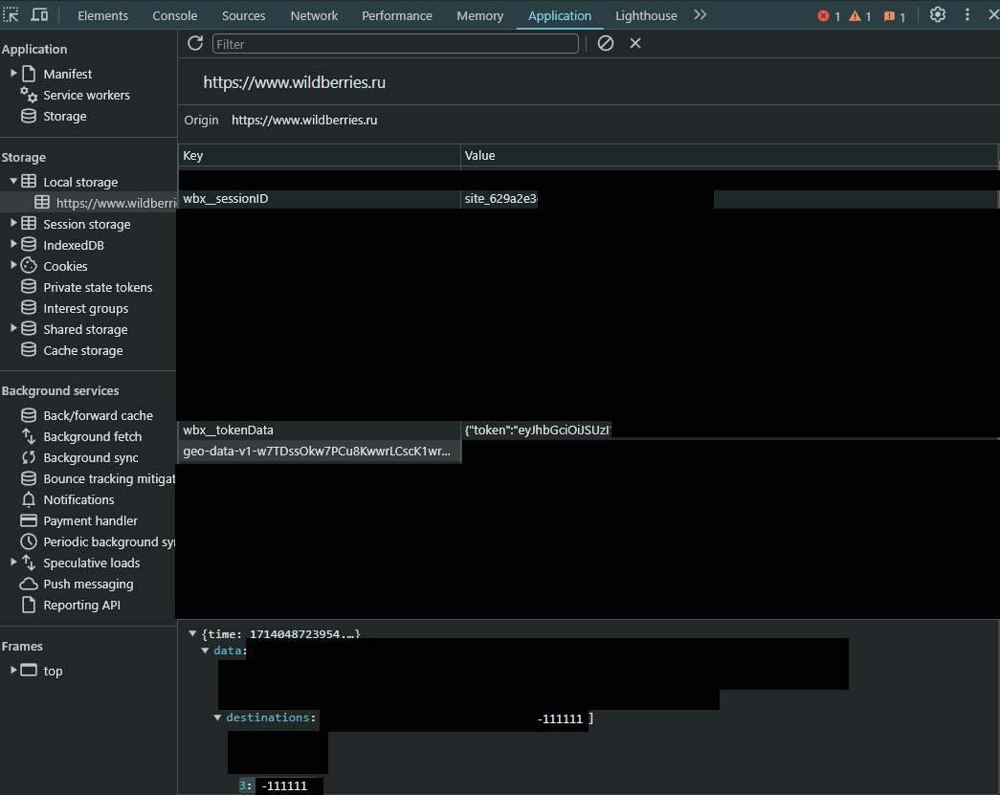

# TestTask
## Рабочее задание
Требуется написать код, который создает заказ в корзине личного кабинета Wildberries

Технические пояснения:

* номенклатура берется из ссылки на  карточку, например
https://www.wildberries.ru/catalog/148748593/detail.aspx - номенклатура 148748593
* Для записи в корзину используем  Rest API запросы в ЛК Wildberries 
(нужно зарегистрироваться и добавить несколько товаров в корзину и подглядеть трассировщиком) Кабинет клиента Wildberries - web приложение без открытого АПИ, поэтому нужно посмотреть вызовы браузера и подменить их заголовки, куки, итп), т.е. повторить такое добавление программно
* Результатом работы программы должна служить строка в корзине с заданной номенклатурой (передается как параметр)
* Код пишем на языке C# .NET Core. Вызовы АПИ проводим стандартно через Http Client
* Формат приложения - любой, проще всего консольное приложение, но можно и Unit tests

## Описание функционала
Была написана библиотека [WildberriesAPI](WildberriesAPI/WildAPI.cs) и [приложение](TestTask/Program.cs) для демонстрации её возможностей, а также [Unit-тесты](WildberriesAPITests/SimpleTests.cs). Инструкции по запуску будут описаны ниже.

## Инструкция по использованию приложения
В файле [конфигурации](TestTask/appsettings.json) необходимо указать id-девайса. Можно использовать любое немного поменяв текущее значение. На работу это не скажется. Там же необходимо вбить свой номер телефона в формате примера, а также географические координаты, которые можно получить, используя любую карту. В примере вбиты координаты Москвы. 

После первого запуска приложения будет предложено ввести значение каптчи, расположенной рядом с программой. Путь к каптче будет указан в консоле. Регистр ввода не имеет значения.

Если значение каптчи было введено верно или устройство не нуждается в вводе каптчи, то на указанный телефон придёт уведомление с кодом, который необходимо также ввести в консоль.

Если в процессе авторизации произошла какая-нибудь ошибка, приложение сообщит об этом. В таком случае необходимо попытаться ещё раз через ~2 минуты.
При удачной авторизации приложение встретит нас меню, через которое можно добавить товар по url или по артиклю в корзину, а также посмотреть корзину.

Для примера добавим какой-нибудь товар в корзину по ссылке в количестве 3-х штук. После этого выведем содержание корзины.

Как видно, товар добавился. Это можно подтвердить и через сайт.

При стандартном выходе из приложения токен будет записан в файл и в дальнейшем при запуске авторизация не потребуется.

## Инструкция по запуску тестов

Для тестов необходимо сначала настроить файл [конфигурации](WildberriesAPITests/appsettings.json). Для её заполнение необходимо выполнить вход в аккаунт в браузере и с помощью инструментов разработчика перенести некоторые значения из Local storage. А именно: из wbx_sessionID взять значение DeviceId, из geo-data... вычленить Latitude и Longitude, а также destinations и перенести в соответствующие строки конфигурации. Необходимо вычленить token из wbx_tokenData и также перенести в конфигурацию.

После этих манипуляций необходимо очистить из браузера корзину и выполнить все тесты. При успешном выполении тестов корзина заполнится некоторыми товарами. При повторном запуске тестов надо также очищать корзину.